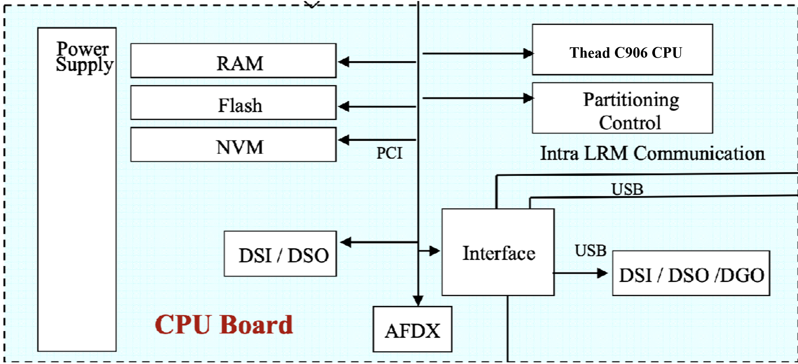

# A deep dive into QEMU: a new machine

In this post, we will see how to create a new machine. Opportunity is
given to introduce the so called QOM.

## Available Machines and CPUs

The available machines for a given architecture can be listed with the
`-M ?` command line option.

For the RISC-V target architecture we have:

```bash
$ qemu-system-riscv64 -M ?
Supported machines are:
amd-microblaze-v-generic AMD Microblaze-V generic platform
microchip-icicle-kit Microchip PolarFire SoC Icicle Kit
none                 empty machine
shakti_c             RISC-V Board compatible with Shakti SDK
sifive_e             RISC-V Board compatible with SiFive E SDK
sifive_u             RISC-V Board compatible with SiFive U SDK
spike                RISC-V Spike board (default)
virt                 RISC-V VirtIO board
```

Once you picked-up your favorite machine, you can also choose between
available CPUs for the related machine.

```bash
$ qemu-system-riscv64 -M virt -cpu ?
  rv32
  rv32e
...
  sifive-u54
  thead-c906
...
```

## The clabpu machine

Let's create a new machine to support the `clabpu` machine. This is adopted from the Airbus
[CPIOM machine](http://www.artist-embedded.org/docs/Events/2007/IMA/Slides/ARTIST2_IMA_Itier.pdf).

The CLab Processor Units (CLabPU) are imaginary machines
designed to run the CLab Operating System (CLabOS). They are based on thead-c906 RISC-V CPU based embeded equipements
with RAM, Flash, NVM, Timers, Interrupt controller, DMA engine, PCI
controller and others components we won't cover (AFDX, DSP).



## Code organisation

First let's prepare our environment by isolating our clabpu code in a
dedicated directory. Usually, every single object you add to QEMU
should be placed in the right directory. They are organized by nature,
not target usage or association.

- a new RISC-V based machine should land in `hw/riscv/`
- a new serial device in `hw/char/`
- a new PCI host controller in `hw/pci-host/`
- a new network controller in `hw/net/`
- ...

So let's do the opposite and put everything at the same place in
`hw/riscv`. The first thing we have to do is tell QEMU how to build
our new machine and futur devices:

```bash
$ cat hw/riscv/meson.build
...
riscv_ss.add(when: 'CONFIG_CLABPU', if_true: files('clabpu.c'))
...

$ cat hw/riscv/Kconfig
...
config CLABPU
    bool
    default y
    depends on RISCV64
    select RISCV_NUMA
    select HTIF
    select RISCV_ACLINT
...
```

## Creating a new machine: `hw/riscv/clabpu.c`

To implement a new machine in QEMU we will need to create QOM
[`TypeInfo`](https://github.com/qemu/qemu/tree/v10.0.2/include/qom/object.h#L435)
and its associated
[`MachineClass`](https://github.com/qemu/qemu/tree/v10.0.2/include/hw/boards.h#L175)
and
[`MachineState`](https://github.com/qemu/qemu/tree/v10.0.2/include/hw/boards.h#395)
initialization functions.

You can find documentation about [QOM
conventions](https://wiki.qemu.org/Documentation/QOMConventions).

### The TypeInfo

We will register a new machine type in QEMU. This is done by defining a `TypeInfo` structure.

```c
static const TypeInfo clabpu_machine_typeinfo = {
    .name       = MACHINE_TYPE_NAME("clabpu"),
    .parent     = TYPE_MACHINE,
    .class_init = clabpu_machine_init,
    .instance_init = clabpu_machine_instance_init,
    .instance_size = sizeof(CLabPUState),
};

static void clabpu_machine_init_register_types(void)
{
    type_register_static(&clabpu_machine_typeinfo);
}

type_init(clabpu_machine_init_register_types)
```

This will register a new machine class type for our CLabPU. This is the
highest level definition.

### The MachineClass

As the API states, our `class_init` function will be called after all
parent class init methods have been called. The class is initialized
before any object instance of the class.

Let's write it :

```c
void clabpu_machine_init(ObjectClass *oc, void *data)
{
    MachineClass *mc = MACHINE_CLASS(oc);

    mc->desc = "CLab Processor Units";
    mc->init = clabpu_init;
    mc->default_cpu_type = TYPE_RISCV_CPU_THEAD_C906;
    mc->default_ram_size = 0x80000000; // 2GB
    mc->default_ram_id = "clabpu.ram";
    mc->max_cpus = 1;
    mc->default_cpus = 1;
    // riscv specific properties
    mc->possible_cpu_arch_ids = riscv_numa_possible_cpu_arch_ids;
    mc->cpu_index_to_instance_props = riscv_numa_cpu_index_to_props;
    mc->get_default_cpu_node_id = riscv_numa_get_default_cpu_node_id;
    mc->numa_mem_supported = true;
}
```

At this point we are able to define specific properties of the
machine, such as the CPU model, the RAM size, and most importantly the
instance initialization method `clabpu_init`.


### The MachineState

Once the class is ready, an object instance will be created. We
previously provided an `mc->init = clabpu_init` function.

```c
static void clabpu_init(MachineState *machine)
{
    CLabPUState *clabpu = CLABPU_MACHINE(machine);

    clabpu_init_cpu(clabpu, machine);
    clabpu_init_mem(clabpu, machine);
    clabpu_init_dev(clabpu, machine);
    clabpu_init_boot(clabpu);
}
```
The core features of our board implementation will lie here.


## Initializing a CPU for the CLabPU: Thead C906

RISC-V machines in QEMU often use hart arrays to manage multiple CPU cores (harts). The cpu instantiation will look like the following:

```c
static void clabpu_init_cpu(CLabPUState *clabpu, MachineState *machine){
    int base_hartid, hart_count; 
    char *soc_name;
    if (riscv_socket_count(machine) != 1) {
        error_report("number of sockets/nodes should be 1 for CLabPU");
        exit(1);
    }

    if (!riscv_socket_check_hartids(machine, 0)) {
        error_report("discontinuous hartids in socket0");
        exit(1);
    }

    base_hartid = riscv_socket_first_hartid(machine, 0);
    if (base_hartid < 0) {
        error_report("can't find hartid base for socket%d", 0);
        exit(1);
    }

    hart_count = riscv_socket_hart_count(machine, 0);
    if (hart_count < 0) {
        error_report("can't find hart count for socket%d", 0);
        exit(1);
    }

    soc_name = g_strdup_printf("clabpu-socket0");
    object_initialize_child(OBJECT(machine), soc_name, &clabpu->soc,
                            TYPE_RISCV_HART_ARRAY);
    g_free(soc_name);
    object_property_set_str(OBJECT(&clabpu->soc), "cpu-type",
                            machine->cpu_type, &error_abort);
    object_property_set_int(OBJECT(&clabpu->soc), "hartid-base",
                            base_hartid, &error_abort);
    object_property_set_int(OBJECT(&clabpu->soc), "num-harts",
                            hart_count, &error_abort);
    sysbus_realize(SYS_BUS_DEVICE(&clabpu->soc), &error_fatal);
}
```

### Obtaining a RISC-V CPU state object

RISC-V uses the concept of "harts" (hardware threads) and they are typically managed through hart arrays. The CPU type we want is the Thead C906, which is defined in the RISC-V CPU models.

The Thead C906 CPU initialization can be found in [target/riscv/cpu.c](https://github.com/qemu/qemu/blob/v10.0.2/target/riscv/cpu.c#L534). This initialization sets up the Thead C906 with its specific extensions and configuration, including the Thead-specific instruction extensions.

### Accessing RISC-V CPU State

QEMU provides dynamic type cast macros for safe navigation through inherited classes:

```c
CPUState        *cs       = CPU(cpu_obj);
RISCVCPU        *riscv    = RISCV_CPU(cs);
CPURISCVState   *env      = &riscv->env;
```
The RISC-V CPU state structure contains RISC-V specific registers and configuration. You can found the definition in [target/riscv/cpu.h](https://github.com/qemu/qemu/blob/v10.0.2/target/riscv/cpu.h#206).

To access general purpose register x14 (GPR[14]):
```c
uint64_t gpr14 = env->gpr[14];
```

### Conclusion

You can see that a new machine is shown in the list of available machines. Don't forget to build and install your QEMU before running the command:

```bash
$ qemu-system-riscv64 -M ?
Supported machines are:
...
clabpu               CLab Processor Units
...
```

Try init a CLabPU machine with the following command:

```bash
$ qemu-system-riscv64 -M clabpu -cpu thead-c906 -nographic
```

This is not exhaustive, but you got the point. If you want to learn more about RISC-V CPU models, you can refer to the [RISC-V CPU Models documentation](https://www.qemu.org/docs/master/system/target-riscv.html).

### Side note

QEMU has its own conventions and programming style. Let us take `DECLARE_INSTANCE_CHECKER ` as an example. DECLARE_INSTANCE_CHECKER is a macro introduced in QEMU's QOM (QEMU Object Model) to provide type-safe casting functions for object instances. It's part of QEMU's effort to modernize and standardize the way object types are declared and used throughout the codebase.

#### Syntax

```c
DECLARE_INSTANCE_CHECKER(InstanceType, MACRO_NAME, TYPE_NAME)
```

Where:
- `InstanceType`: The C struct type for your object instance
- `MACRO_NAME`: The name of the generated cast macro (typically uppercase)
- `TYPE_NAME`: The QOM type name string

The macro expands to create a static inline function that:
- Checks if the object is of the correct type (in debug mode)
- Performs a safe cast to the target type
- Returns NULL if the cast is invalid (in debug mode)

Also, the object lifecycle is managed through QOM, which includes object creation, initialization, and destruction. Don't use `gnew_` or `g_malloc0_` to allocate memory for QOM objects. Instead, use `object_new()` or `object_initialize_child()` to create and initialize objects properly.
